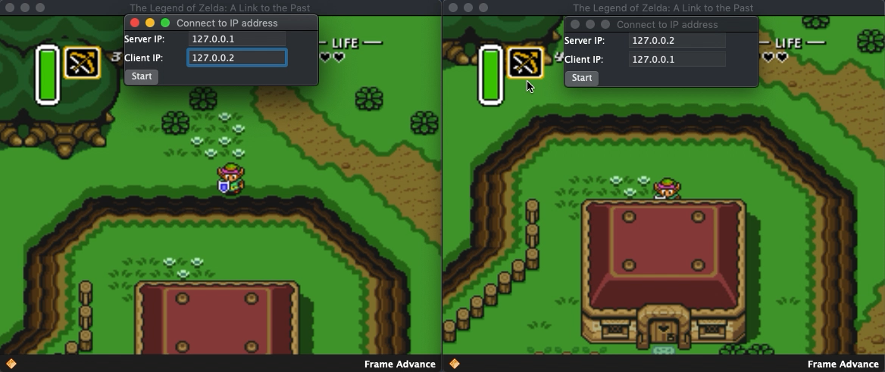

AngelScript
===========
I have embedded the [AngelScript v2.33.0](https://www.angelcode.com/angelscript/) engine into the bsnes code and created
some rudimentary script function bindings between the bsnes emulator and AngelScript scripts.

Download nightly binary builds here:
https://cirrus-ci.com/github/JamesDunne/bsnes-angelscript

Screenshots
---

Why AngelScript?
----------------

I came up with an ideal set of criteria for a scripting language to adhere to in order to seamlessly integrate with
bsnes:

1. Easy integration with an existing C/C++ codebase (bsnes)
    * Should be available for direct embedding within bsnes or at least accessible via static library
    * If directly embeddable, must seamlessly integrate with existing build system (bsnes's composed `GNUmakefile`s)
2. Low developer overhead
    * Should be easy to define interfaces, functions, and properties for bsnes to expose to scripts and vice-versa
    * Avoid proxy code and data marshalling at runtime used for calling functions bidirectionally
3. Low runtime overhead
    * Script functions should ideally have compatible calling conventions with bsnes (CDECL or THISCALL) to cut down on
    per-call overhead
4. Fast performance since script functions will likely be called at least once per frame
5. Familiar script syntax and similar language conventions to C/C++ code to avoid surprises for script developers
    * Primitive data types can be shared between bsnes and scripts to avoid proxying and marshalling
    * Must have first-class support for native integer types (int, uint, uint8, uint16, uint32, etc.)
    * Must have first-class support for binary operations on integer types (and, or, not, xor, bit shifting, etc.)
    * Must have support for array types; array indices must start at `0` (looking at you, Lua)
6. Script language MUST NOT be allowed to access anything outside of its scripting environment unless explicitly
designed for and controlled by bsnes
    * No external `.dll`/`.dylib`/`.so` dynamic library loading unless explicitly allowed by bsnes
    * No access to filesystem unless explicitly allowed by bsnes
    * No access to network or external peripherals unless explicitly allowed by bsnes
7. Supports building a script debugger within bsnes
8. Ideally statically typed with good compiler errors and warnings

As you can already guess, AngelScript meets all of these criteria.

Why not Lua?
------------

When looking at popular choices for scripting languages to embed into programs, Lua seems like a natural choice at
first, but in practice doesn't meet most of the criteria listed above.

Lua only supports 8 primitive data types: nil, boolean, number, string, function, userdata, thread, and table.

There is no native support for integer types which is a big deal for emulators since these systems do not generally
deal with IEEE floating point values and it is a lot of wasted runtime, developer time, and energy to convert back and
forth between floating point and integers.

Lua also has no native support for binary operations on integers. There exists a C extension module `bitop` that adds
support for this but it feels very clunky to use as all these operations are done with function calls and are not
available as native infix binary operators, e.g. (`xor(a,b)` vs `a xor b` or `a ^ b`).

Lua has fast execution of its own scripts and even has a JIT, however, this speed is limited to executing within its own
scripting environment and is not designed for fast function calling between the host and the script. Lots of support
code is needed to write C extension functions to bridge the gap between Lua and the host application.

Lua array indices start at 1 (by convention) which makes for some unnecessarily different code practices and mental
gymnastics when one is used to working with 0-based array indices which most other mainstream languages use.

UI Updates
==========

Three new options are available in the Tools menu:
  * Load Script ...
  * Reload Script
  * Unload Script

Load Script will open a dialog to select the AngelScript file (*.as) to load. Scripts are always reloaded from files and
are not cached.

Reload Script will reopen the previously selected AngelScript file and recompile it, replacing any existing script.

Unload Script will destroy the current script module and free any allocated memory.

AngelScript Interface
=====================

Refer to [this document](angelscript.md) for details on the AngelScript interface to bsnes.

Nightly Builds
==============

  - [Download](https://cirrus-ci.com/github/JamesDunne/bsnes-angelscript/master)
  - 
  - 
  - 
  - 
