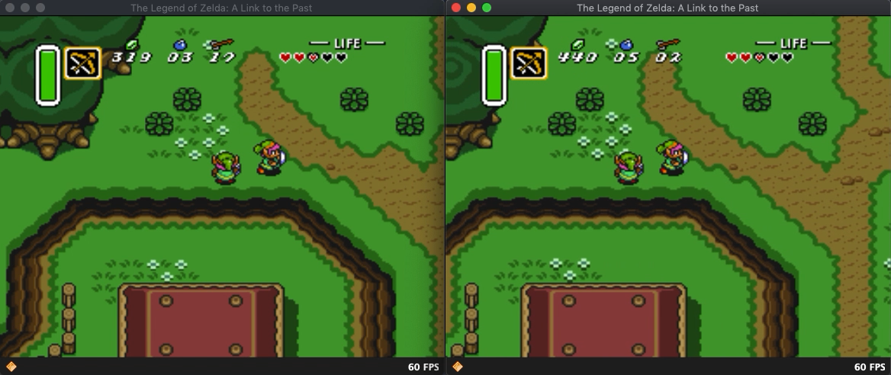

AngelScript
===========
I have embedded the [AngelScript v2.33.0](https://www.angelcode.com/angelscript/) engine into the bsnes code and created some rudimentary script function bindings between the bsnes emulator and AngelScript scripts.

As a working proof of concept of the AngelScript scripting engine and the basic bindings set up, I've developed a script targeted at *Zelda 3: A Link To The Past* that draws white squares around in-game sprites as they are defined in RAM.

Download nightly binary builds here:
https://cirrus-ci.com/github/JamesDunne/bsnes-angelscript

1. Use Tools > Load Script ... > Browse to `alttp-link-oam.as` script included in nightly build package
2. Load a saved state or play through the game to see white rectangles surrounding in-game sprites

Screenshots
---

My Goals
--------
I want to create an emulator add-on defined entirely via scripts that enables a real-time networked multiplayer experience for *Zelda 3: A Link To The Past*. This game has an active and vibrant community surrounding it with things like Randomizer, Crowd Control, and Tournaments.

There appears to be interest in a multiplayer aspect to the game where players can see and interact with one another within the same game world. Some efforts have been made already in this space like with inventory sharing but as far as I'm aware, not to the extent of letting players visually see each other's characters.

The lack of the visual aspect of players seeing each other could be explained by the difficulty in displaying more than one copy of Link on the screen at one time with differing animation frames. VRAM tile data is dynamically updated on every frame depending on the current game state, e.g. Link's current animation frame. If one were to simply draw multiple copies of Link on the screen, they would all appear synchronized in animation which is not ideal for a multiplayer simulation where you would want different players to be performing different actions and hence seeing different animations.

My plan for the visual aspect is essentially to synchronize over the network each player's Link state (x,y coords, overworld room number, dungeon room number, light/dark world, etc.) as well as VRAM data for the current animation frame. This extra VRAM data could be used in a script-extended PPU renderer to essentially have more than one OBJ layer, possibly even one per player. The script-extended PPU rendering would source VRAM data from script variables instead of from the local game ROM. This would preserve custom sprites in each player's ROM.

My near-term goals are to extend bsnes enough through scripts to allow for customization of the PPU rendering per scanline to get a proof of concept going.

Why AngelScript?
----------------

I came up with an ideal set of criteria for a scripting language to adhere to in order to seamlessly integrate with bsnes:

1. Easy integration with an existing C/C++ codebase (bsnes)
    * Should be available for direct embedding within bsnes or at least accessible via static library
    * If directly embeddable, must seamlessly integrate with existing build system (bsnes's composed `GNUmakefile`s)
2. Low developer overhead
    * Should be easy to define interfaces, functions, and properties for bsnes to expose to scripts and vice-versa
    * Avoid proxy code and data marshalling at runtime used for calling functions bidirectionally
3. Low runtime overhead
    * Script functions should ideally have compatible calling conventions with bsnes (CDECL or THISCALL) to cut down on per-call overhead
4. Fast performance since script functions will likely be called at least once per frame
5. Familiar script syntax and similar language conventions to C/C++ code to avoid surprises for script developers
    * Primitive data types can be shared between bsnes and scripts to avoid proxying and marshalling
    * Must have first-class support for native integer types (int, uint, uint8, uint16, uint32, etc.)
    * Must have first-class support for binary operations on integer types (and, or, not, xor, bit shifting, etc.)
    * Must have support for array types; array indices must start at `0` (looking at you, Lua)
6. Script language MUST NOT be allowed to access anything outside of its scripting environment unless explicitly designed for and controlled by bsnes
    * No external `.dll`/`.dylib`/`.so` dynamic library loading unless explicitly allowed by bsnes
    * No access to filesystem unless explicitly allowed by bsnes
    * No access to network or external peripherals unless explicitly allowed by bsnes
7. Supports building a script debugger within bsnes
8. Ideally statically typed with good compiler errors and warnings

As you can already guess, AngelScript meets all of these criteria.

Why not Lua?
------------

When looking at popular choices for scripting languages to embed into programs, Lua seems like a natural choice at first, but in practice doesn't meet most of the criteria listed above.

Lua only supports 8 primitive data types: nil, boolean, number, string, function, userdata, thread, and table.

There is no native support for integer types which is a big deal for emulators since these systems do not generally deal with IEEE floating point values and it is a lot of wasted runtime, developer time, and energy to convert back and forth between floating point and integers.

Lua also has no native support for binary operations on integers. There exists a C extension module `bitop` that adds support for this but it feels very clunky to use as all these operations are done with function calls and are not available as native infix binary operators, e.g. (`xor(a,b)` vs `a xor b` or `a ^ b`).

Lua has fast execution of its own scripts and even has a JIT, however, this speed is limited to executing within its own scripting environment and is not designed for fast function calling between the host and the script. Lots of support code is needed to write C extension functions to bridge the gap between Lua and the host application.

Lua array indices start at 1 (by convention) which makes for some unnecessarily different code practices and mental gymnastics when one is used to working with 0-based array indices which most other mainstream languages use.

---

UI Updates
==========

Three new options are available in the Tools menu:
  * Load Script ...
  * Reload Script
  * Unload Script

Load Script will open a dialog to select the AngelScript file (*.as) to load. Scripts are always reloaded from files and are not cached.

Reload Script will reopen the previously selected AngelScript file and recompile it, replacing any existing script.

Unload Script will destroy the current script module and free any allocated memory.

AngelScript Interface
=====================

Refer to [this document](angelscript.md) for details on the AngelScript interface to bsnes.

---

bsnes
=====

bsnes is a multi-platform Super Nintendo (Super Famicom) emulator that focuses
on performance, features, and ease of use.

bsnes currently enjoys 100% known, bug-free compatibility with the entire SNES
library when configured to its most accurate settings, giving it the same
accuracy level as higan. Accuracy can also optionally be traded for performance,
allowing bsnes to operate more than 300% faster than higan while still remaining
almost as accurate.

Development
-----------

Git is used for the development of new releases, and represents a staging
environment. As bsnes is rather mature, things should generally be quite stable.
However, bugs will exist, regressions will occur, so proceed at your own risk.

If stability is required, please download the latest stable release from the
[official website.](https://bsnes.byuu.org)

Unique Features
---------------

  - 100% (known) bug-free compatibility with the entire officially licensed SNES games library
  - True Super Game Boy emulation (using the SameBoy core by Lior Halphon)
  - HD mode 7 graphics with optional supersampling (by DerKoun)
  - Low-level emulation of all SNES coprocessors (DSP-n, ST-01n, Cx4)
  - Multi-threaded PPU graphics renderer
  - Speed mode settings which retain smooth audio output (50%, 75%, 100%, 150%, 200%)
  - Built-in games database with thousands of game entries
  - Built-in cheat code database for hundreds of popular games (by mightymo)
  - Built-in save state manager with screenshot previews and naming capabilities
  - Support for ASIO low-latency audio
  - Customizable per-byte game mappings to support any cartridges, including prototype games
  - 7-zip decompression support
  - Extensive Satellaview emulation, including BS Memory flash write and wear-leveling emulation
  - 30-bit color output support (where supported)
  - Optional higan game folder support (standard game ROM files are also fully supported!)

Standard Features
-----------------

  - MSU1 support
  - BPS and IPS soft-patching support
  - Save states with undo and redo support (for reverting accidental saves and loads)
  - OpenGL multi-pass pixel shaders
  - Several built-in software filters, including HQ2x (by MaxSt) and snes_ntsc (by blargg)
  - Adaptive sync and dynamic rate control for perfect audio/video synchronization
  - Just-in-time input polling for minimal input latency
  - Support for Direct3D exclusive mode video
  - Support for WASAPI exclusive mode audio
  - Periodic auto-saving of game saves
  - Auto-saving of states when unloading games, and auto-resuming of states when reloading games
  - Sprite limit disable support
  - Cubic audio interpolation support
  - Optional high-level emulation of most SNES coprocessors
  - CPU, SA1, and SuperFX overclocking support
  - Frame advance support
  - Screenshot support
  - Cheat code search support
  - Movie recording and playback support
  - Rewind support
  - HiDPI support

Links
-----

  - [Official website](https://bsnes.byuu.org)
  - [Official git repository](https://github.com/byuu/bsnes)
  - [Donations](https://patreon.com/byuu)

Nightly Builds
--------------

  - [Download](https://cirrus-ci.com/github/byuu/bsnes/master)
  - 
  - 
  - 
  - 
