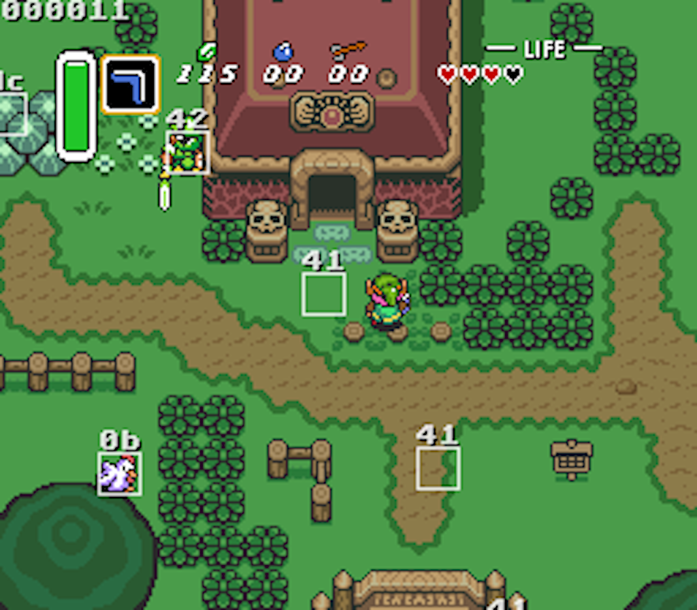
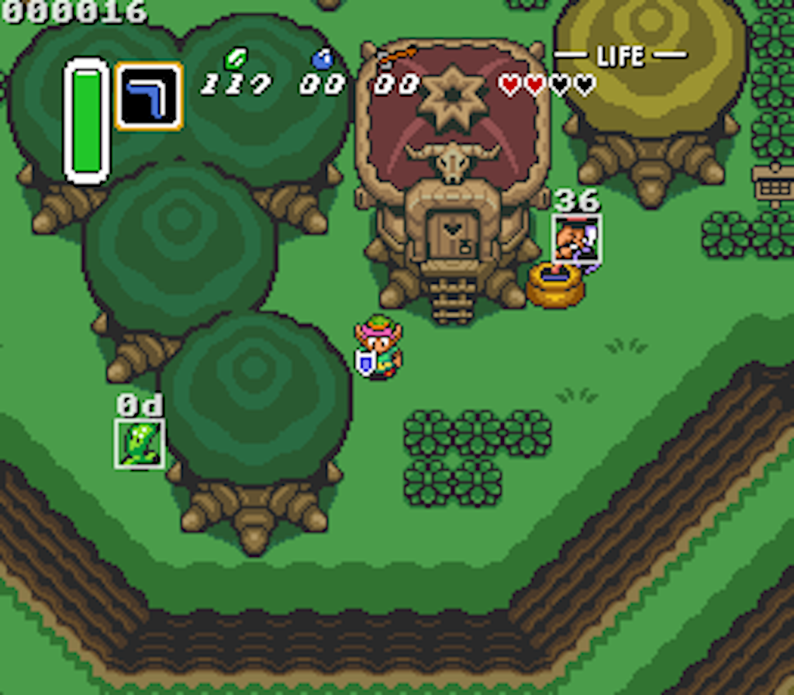

AngelScript
===========
I have embedded the [AngelScript v2.33.0](https://www.angelcode.com/angelscript/) engine into the bsnes code and created some rudimentary script function bindings between the bsnes emulator and AngelScript scripts.

As a working proof of concept of the AngelScript scripting engine and the basic bindings set up, I've developed a script targeted at *Zelda 3: A Link To The Past* that draws white squares around in-game sprites as they are defined in RAM. To test this proof of concept:

1. clone this repository
2. `cd` to repository working copy directory
3. `make -C bsnes`
4. `./test.sh`. **NOTE:** You will have to modify `test.sh` to override the location of your ALTTP ROM file as it's highly unlikely to be identical to mine.
5. Tools > Load Script ... > Browse to `script.as` in repository root
6. Load a saved state or play through the game to see white rectangles surrounding in-game sprites

Screenshots
---





Example AngelScript
---
```
// AngelScript for ALTTP to draw white rectangles around in-game sprites
uint16   xoffs, yoffs;
uint16[] sprx(16);
uint16[] spry(16);
uint8[]  sprs(16);
uint8[]  sprk(16);
uint32   location;

void init() {
  // initialize script state here.
  message("hello world!");
}

void main() {
  // fetch various room indices and flags about where exactly Link currently is:
  auto in_dark_world  = SNES::Bus::read_u8 (0x7E0FFF);
  auto in_dungeon     = SNES::Bus::read_u8 (0x7E001B);
  auto overworld_room = SNES::Bus::read_u16(0x7E008A, 0x7E008B);
  auto dungeon_room   = SNES::Bus::read_u16(0x7E00A0, 0x7E00A1);

  // compute aggregated location for Link into a single 24-bit number:
  location =
    uint32(in_dark_world & 1) << 17 |
    uint32(in_dungeon & 1) << 16 |
    uint32(in_dungeon != 0 ? dungeon_room : overworld_room);

  // get screen x,y offset by reading BG2 scroll registers:
  xoffs = SNES::Bus::read_u16(0x7E00E2, 0x7E00E3);
  yoffs = SNES::Bus::read_u16(0x7E00E8, 0x7E00E9);

  for (int i = 0; i < 16; i++) {
    // sprite x,y coords are absolute from BG2 top-left:
    spry[i] = SNES::Bus::read_u16(0x7E0D00 + i, 0x7E0D20 + i);
    sprx[i] = SNES::Bus::read_u16(0x7E0D10 + i, 0x7E0D30 + i);
    // sprite state (0 = dead, else alive):
    sprs[i] = SNES::Bus::read_u8(0x7E0DD0 + i);
    // sprite kind:
    sprk[i] = SNES::Bus::read_u8(0x7E0E20 + i);
  }
}

void postRender() {
  // set drawing state:
  SNES::PPU::frame.font_height = 8; // select 8x8 or 8x16 font for text
  // draw using alpha blending
  SNES::PPU::frame.draw_op = SNES::PPU::DrawOp::op_alpha;
  // alpha is xx/31:
  SNES::PPU::frame.alpha = 24;
  // color is 0x7fff aka white (15-bit RGB)
  SNES::PPU::frame.color = SNES::rgb(31, 31, 31);

  // enable shadow under text for clearer reading:
  SNES::PPU::frame.text_shadow = true;

  // draw Link's location value in top-left:
  SNES::PPU::frame.text(0, 0, fmtHex(location, 6));

  for (int i = 0; i < 16; i++) {
    // skip dead sprites:
    if (sprs[i] == 0) continue;

    // subtract BG2 offset from sprite x,y coords to get local screen coords:
    int16 rx = int16(sprx[i]) - int16(xoffs);
    int16 ry = int16(spry[i]) - int16(yoffs);

    // draw box around the sprite:
    SNES::PPU::frame.rect(rx, ry, 16, 16);

    // draw sprite type value above box:
    ry -= SNES::PPU::frame.font_height;
    SNES::PPU::frame.text(rx, ry, fmtHex(sprk[i], 2));
  }
}
```

The final script bindings in bsnes will likely not look like those demonstrated here. I will introduce better drawing commands as well as some pixel-font text rendering support.

My Goals
--------
I want to create an emulator add-on defined entirely via scripts that enables a real-time networked multiplayer experience for *Zelda 3: A Link To The Past*. This game has an active and vibrant community surrounding it with things like Randomizer, Crowd Control, and Tournaments.

There appears to be interest in a multiplayer aspect to the game where players can see and interact with one another within the same game world. Some efforts have been made already in this space like with inventory sharing but as far as I'm aware, not to the extent of letting players visually see each other's characters.

The lack of the visual aspect of players seeing each other could be explained by the difficulty in displaying more than one copy of Link on the screen at one time with differing animation frames. CGRAM is dynamically memory mapped and the mapping (and thus the character data) changes depending on the current game state, e.g. Link's current animation frame. If one were to simply draw multiple copies of Link on the screen, they would all appear synchronized in animation.

My plan for the visual aspect is essentially to synchronize over the network, each player's Link state (x,y coords, overworld room number, dungeon room number, light/dark world, etc.) as well as CGRAM data. This extra CGRAM data could be used in a script-extended PPU renderer to essentially have more than one OBJ layer, possibly even one per player. The script-extended PPU rendering would source CGRAM data from script variables instead of from the local game ROM.

My near-term goals are to extend bsnes enough through scripts to allow for customization of the PPU rendering per scanline to get a proof of concept going.

Why AngelScript?
----------------

I came up with an ideal set of criteria for a scripting language to adhere to in order to seamlessly integrate with bsnes:

1. Easy integration with an existing C/C++ codebase (bsnes)
    * Should be available for direct embedding within bsnes or at least accessible via static library
    * If directly embeddable, must seamlessly integrate with existing build system (bsnes's composed `GNUmakefile`s)
2. Low developer overhead
    * Should be easy to define interfaces, functions, and properties for bsnes to expose to scripts and vice-versa
    * Avoid proxy code and data marshalling at runtime used for calling functions bidirectionally
3. Low runtime overhead
    * Script functions should ideally have compatible calling conventions with bsnes (CDECL or THISCALL) to cut down on per-call overhead
4. Fast performance since script functions will likely be called at least once per frame
5. Familiar script syntax and similar language conventions to C/C++ code to avoid surprises for script developers
    * Primitive data types can be shared between bsnes and scripts to avoid proxying and marshalling
    * Must have first-class support for native integer types (int, uint, uint8, uint16, uint32, etc.)
    * Must have first-class support for binary operations on integer types (and, or, not, xor, bit shifting, etc.)
    * Must have support for array types; array indices must start at `0` (looking at you, Lua)
6. Script language MUST NOT be allowed to access anything outside of its scripting environment unless explicitly designed for and controlled by bsnes
    * No external `.dll`/`.dylib`/`.so` dynamic library loading unless explicitly allowed by bsnes
    * No access to filesystem unless explicitly allowed by bsnes
    * No access to network or external peripherals unless explicitly allowed by bsnes
7. Supports building a script debugger within bsnes
8. Ideally statically typed with good compiler errors and warnings

As you can already guess, AngelScript meets all of these criteria.

Why not Lua?
------------

When looking at popular choices for scripting languages to embed into programs, Lua seems like a natural choice at first, but in practice doesn't meet most of the criteria listed above.

Lua only supports 8 primitive data types: nil, boolean, number, string, function, userdata, thread, and table.

There is no native support for integer types which is a big deal for emulators since these systems do not generally deal with IEEE floating point values and it is a lot of wasted runtime, developer time, and energy to convert back and forth between floating point and integers.

Lua also has no native support for binary operations on integers. There exists a C extension module `bitop` that adds support for this but it feels very clunky to use as all these operations are done with function calls and are not available as native infix binary operators, e.g. (`xor(a,b)` vs `a xor b` or `a ^ b`).

Lua has fast execution of its own scripts and even has a JIT, however, this speed is limited to executing within its own scripting environment and is not designed for fast function calling between the host and the script. Lots of support code is needed to write C extension functions to bridge the gap between Lua and the host application.

Lua array indices start at 1 (by convention) which makes for some unnecessarily different code practices and mental gymnastics when one is used to working with 0-based array indices which most other mainstream languages use.

---

AngelScript Interface
=====================

Two new options are available in the Tools menu:
  * Load Script ...
  * Reload Script

Load Script will open a dialog to select the AngelScript file to load. Scripts are always reloaded from files and are not cached.

Reload Script will reopen the previously selected AngelScript file and recompile it, replacing any existing script.

bsnes can bind to these optional functions defined by scripts:

  * `void init()` - called once immediately after script loaded or reloaded
  * `void main()` - called after a frame is swapped to the display
  * `void postRender()` - called after a frame is rendered by the PPU but before it is swapped to the display

No other functions than these are called by the emulator so you must use these to control your script behavior.

In `void init()` you'll want to initialize any state for your script or set properties on the emulator.

In `void main()` you will want to read (or write) memory values and store them in your script variables. **Do not** call frame drawing functions in this method as the frame has already been copied to the display and its contents cleared.

In `void postRender()` you may draw on top of the rendered frame using the `SNES::PPU::frame` object.

`void main()` and `void postRender()` are split to avoid a 1-frame latency for drawing.

Global Functions
----------------

  * `void message(const string &in msg)` - show a message on emulator status bar, like a notification
  * `string &fmtHex(uint64 value, int precision = 0)` - formats a `uint64` in hexadecimal using `precision` number of digits
  * `string &fmtBinary(uint64 value, int precision = 0)` - formats a `uint64` in binary using `precision` number of digits
  * `string &fmtInt(int64 value)` - formats a `int64` as a string
  * `string &fmtUint(uint64 value)` - formats a `uint64` as a string

Memory
------

All definitions in this section are defined in the `SNES::Bus` namespace, e.g. `SNES::Bus::read_u8`.

* `uint8 read_u8(uint32 addr)` - reads a `uint8` value from the given bus address (24-bit)
* `uint16 read_u16(uint32 addr0, uint32 addr1)` - reads a `uint16` value from the given bus addresses, using `addr0` for the low byte and `addr1` for the high byte. `addr0` and `addr1` can be any address or even the same address. `addr0` is always read before `addr1` is read.
* `void write_u8(uint32 addr, uint8 data)` - writes a `uint8` value to the given bus address (24-bit)

PPU Frame Access
----------------

Globals:
  * `SNES::PPU::Frame SNES::PPU::frame { get; }` - global read-only property representing the current rendered PPU frame that is ready to swap to the display. Contains methods and properties that allow for drawing things on top of the frame.
  * `uint16 SNES::rgb(uint8 r, uint8 g, uint8 b)` - function used to construct 15-bit RGB color values; each color channel is a 5-bit value between 0..31.

Notes:
  * Coordinate system used: x = 0 up to 512 from left to right, y = 0 up to 480 from top to bottom; both coordinates depend on scaling settings, interlace mode, etc.
  * `uint16` type is used for representing 15-bit RGB colors, where each color channel is allocated 5 bits each, from least-significant bits for blue, to most-significant bits for red. The most significant bit of the `uint16` value for color should always be `0`. `0x7fff` is full-white and `0x0000` is full black.
  * alpha channel is represented in a `uint8` type as a 5-bit value between 0..31 where 0 is completely transparent and 31 is completely opaque.
  * alpha blending equation is `[src_rgb*src_a + dst_rgb*(31 - src_a)] / 31`
  * `SNES::PPU::DrawOp` - enum of drawing operations used to draw pixels; available drawing operations are:
     * `SNES::PPU::DrawOp::op_solid` - draw solid pixels, ignoring alpha (default)
     * `SNES::PPU::DrawOp::op_alpha` - draw new pixels alpha-blended with existing pixels
     * `SNES::PPU::DrawOp::op_xor` - XORs new pixel color value with existing pixel color value

`SNES::PPU::Frame` properties:
  * `int y_offset { get; set; }` - property to adjust Y-offset of drawing functions (default = +8; skips top overscan area so that x=0,y=0 is top-left of visible screen)
  * `SNES::PPU::DrawOp draw_op { get; set; }` - current drawing operation used to draw pixels
  * `uint16 color { get; set; }` - current color for drawing with (0..0x7fff)
  * `uint8 alpha { get; set; }` - current alpha value for drawing with (0..31)
  * `int font_height { get; set; }` - current font height in pixels; valid values are 8 or 16 (default = 8).

`SNES::PPU::Frame` methods:
  * `uint16 read_pixel(int x, int y)` - gets the 15-bit RGB color at the x,y coordinate in the PPU frame
  * `void pixel(int x, int y, uint16 color)` - sets the 15-bit RGB color at the x,y coordinate in the PPU frame
  * `void hline(int lx, int ty, int w)` - draws a horizontal line
  * `void vline(int lx, int ty, int h)` - draws a vertical line
  * `void rect(int x, int y, int w, int h)` - draws a rectangle
  * `int text(int x, int y, const string &in text)` - draws a horizontal span of ASCII text using the current `font_height`; all non-printable characters and control characters (CR, LF, TAB, etc) are skipped over and are not rendered; returns number of characters drawn

All drawing operations are performed immediately and directly on the PPU frame buffer. There is no second frame buffer on top for compositing or alpha-blending of whole images.

---

bsnes
=====

bsnes is a multi-platform Super Nintendo (Super Famicom) emulator that focuses
on performance, features, and ease of use.

bsnes currently enjoys 100% known, bug-free compatibility with the entire SNES
library when configured to its most accurate settings, giving it the same
accuracy level as higan. Accuracy can also optionally be traded for performance,
allowing bsnes to operate more than 300% faster than higan while still remaining
almost as accurate.

Development
-----------

Git is used for the development of new releases, and represents a staging
environment. As bsnes is rather mature, things should generally be quite stable.
However, bugs will exist, regressions will occur, so proceed at your own risk.

If stability is required, please download the latest stable release from the
[official website.](https://bsnes.byuu.org)

Unique Features
---------------

  - 100% (known) bug-free compatibility with the entire officially licensed SNES games library
  - True Super Game Boy emulation (using the SameBoy core by Lior Halphon)
  - HD mode 7 graphics with optional supersampling (by DerKoun)
  - Low-level emulation of all SNES coprocessors (DSP-n, ST-01n, Cx4)
  - Multi-threaded PPU graphics renderer
  - Speed mode settings which retain smooth audio output (50%, 75%, 100%, 150%, 200%)
  - Built-in games database with thousands of game entries
  - Built-in cheat code database for hundreds of popular games (by mightymo)
  - Built-in save state manager with screenshot previews and naming capabilities
  - Support for ASIO low-latency audio
  - Customizable per-byte game mappings to support any cartridges, including prototype games
  - 7-zip decompression support
  - Extensive Satellaview emulation, including BS Memory flash write and wear-leveling emulation
  - 30-bit color output support (where supported)
  - Optional higan game folder support (standard game ROM files are also fully supported!)

Standard Features
-----------------

  - MSU1 support
  - BPS and IPS soft-patching support
  - Save states with undo and redo support (for reverting accidental saves and loads)
  - OpenGL multi-pass pixel shaders
  - Several built-in software filters, including HQ2x (by MaxSt) and snes_ntsc (by blargg)
  - Adaptive sync and dynamic rate control for perfect audio/video synchronization
  - Just-in-time input polling for minimal input latency
  - Support for Direct3D exclusive mode video
  - Support for WASAPI exclusive mode audio
  - Periodic auto-saving of game saves
  - Auto-saving of states when unloading games, and auto-resuming of states when reloading games
  - Sprite limit disable support
  - Cubic audio interpolation support
  - Optional high-level emulation of most SNES coprocessors
  - CPU, SA1, and SuperFX overclocking support
  - Frame advance support
  - Screenshot support
  - Cheat code search support
  - Movie recording and playback support
  - Rewind support
  - HiDPI support

Links
-----

  - [Official website](https://bsnes.byuu.org)
  - [Official git repository](https://github.com/byuu/bsnes)
  - [Donations](https://patreon.com/byuu)

Nightly Builds
--------------

  - [Download](https://cirrus-ci.com/github/byuu/bsnes/master)
  - 
  - 
  - 
  - 
