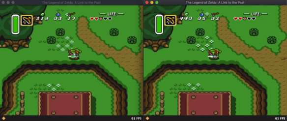

AngelScript interface
=====================

NOTE: Always refer to [script-interface.cpp](bsnes/sfc/interface/script-interface.cpp) for the latest definitions of
script functions.

The SNES system is frozen during script execution and clock cycles are not advanced until the invoked script function returns.

bsnes can bind to these optional functions defined by scripts:

  * `void init()` - called once immediately after script loaded or reloaded
  * `void pre_frame()` - called after the last frame is swapped to the display
  * `void post_frame()` - called after a frame is rendered by the PPU but before it is swapped to the display

No other functions than these are called by the emulator so you must use these to control your script behavior.

In `void init()` you'll want to initialize any state for your script or set properties on the emulator.

In `void pre_frame()` you will want to read (or write) memory values and store them in your script variables. **Do not** call frame drawing functions in this method as the frame has already been copied to the display and its contents cleared.

In `void post_frame()` you may draw on top of the rendered frame using the `ppu::frame` object.

`void pre_frame()` and `void post_frame()` are split to avoid a 1-frame latency for drawing.

Global Functions
----------------

  * `void message(const string &in msg)` - show a message on emulator status bar, like a notification
  * `string &fmtHex(uint64 value, int precision = 0)` - formats a `uint64` in hexadecimal using `precision` number of digits
  * `string &fmtBinary(uint64 value, int precision = 0)` - formats a `uint64` in binary using `precision` number of digits
  * `string &fmtInt(int64 value)` - formats a `int64` as a string
  * `string &fmtUint(uint64 value)` - formats a `uint64` as a string

Memory
------

All definitions in this section are defined in the `bus` namespace, e.g. `bus::read_u8`. 

* `uint8 bus::read_u8(uint32 addr)` - reads a `uint8` value from the given bus address (24-bit)
* `uint16 bus::read_u16(uint32 addr0, uint32 addr1)` - reads a `uint16` value from the given bus addresses, using `addr0` for the low byte and `addr1` for the high byte. `addr0` and `addr1` can be any address or even the same address. `addr0` is always read before `addr1` is read. no clock cycles are advanced between reads.
* `void bus::write_u8(uint32 addr, uint8 data)` - writes a `uint8` value to the given bus address (24-bit)

Reads and writes are done on the main bus and clock cycles are not advanced during read or write.

Graphics Integration
====================

Currently there are two ways to render custom graphics into each game frame rendered by the SNES.

Extra OAM Sprites
-----------------

One way to affect the rendered frame is for scripts to define "extra" OAM sprites that act almost exactly like
hardware OAM sprites do. As such, these "extra" OAM sprites may layer on top of and underneath hardware OAM sprites
generated normally by games. These extra sprites differ from OAM sprites in that they are stored in a direct-color
format as opposed to an indexed color format with CGRAM lookups. Of course, extra sprites may be rendered using CGRAM
lookups but this must be done explicitly by the script instead of implicitly by the PPU. This direct-color feature makes
it ideal to transfer sprite data over a network so as to preserve the exact look of any customized sprite graphics or
palettes without having to affect existing hardware sprites by changing CGRAM palettes or VRAM tile data.

As you can see in the animation above, the extra sprites can alternate priorities with the hardware sprites and can
appear on top of or behind one another. In this case it is achieved by coordinating the OAM sprite index and emulating
that on the renderer. Link's sprites seem to always have a priority of `2` and the game uses the OAM index to give
relative priorities amongst sprites.

Post-Frame Rendering
--------------------

Another way to affect the rendering of a frame is to wait for the PPU to finish rendering a frame and then draw directly
on top of the final frame. This mode is useful for making large-scale annotations on the frame for debugging purposes or
for creating in-game mechanics that don't need tight integration with the PPU. This mode draws directly onto the
rendered PPU frame and is destructive by nature. Supported features are drawing pixels directly, drawing horizontal and
vertical lines, drawing rectangles, and drawing text using an 8x8 or 8x16 pixel font. Drawing operations can make use of
alpha-blending and colors are represented with 15-bit BGR values.

This post-frame mode may only be meaningfully used within the context of the emulator calling the `void post_frame()`
function defined in the script. Do note that if reading SNES memory during `post_frame()`, most values will be relevant
for the _next_ frame and not the current already-rendered frame. This is because most SNES games execute their game
logic while the PPU is rendering a frame and so most RAM is updated while rendering. To avoid this 1 frame delay, it is
advised to read/write memory during `void pre_frame()` and store copies of values read into script variables to be later
drawn or acted upon in `void post_frame()`. Although it is not illegal to call post-frame drawing operations in
`pre_frame()` function, their effect would be meaningless because the frame would be cleared out by the PPU and will be
redrawn.

Rendering Interfaces for Scripts
================================

Note that the SNES works internally with 15-bit BGR colors values.

  * For scripts, the `uint16` type is used for representing 15-bit BGR color values.
  * Each color channel is allocated 5 bits, from least-significant bits for red, to most-significant bits for blue.
  * The most significant bit of the `uint16` value for color should always be `0`.
  * Reference colors:
    * `0x7fff` is 100% white.
    * `0x0000` is 100% black.
    * `0x7c00` is 100% blue.
    * `0x03e0` is 100% green.
    * `0x001f` is 100% red.
  * Since it is cumbersome to mentally compose hex values for 15-bit RGB colors, the `ppu::rgb` function is provided to
  construct the final `uint16` color value given each color channel's 5-bit value.

General PPU Data Access Interface
---------------------------------

`ppu` namespace methods and properties:
  * `uint16 ppu::rgb(uint8 r, uint8 g, uint8 b)` - function used to construct 15-bit RGB color values; each color
  channel is a 5-bit value between 0..31.
  * `uint8 ppu::luma { get; }` - global read-only property representing the current PPU luminance value (0..15) where 0
  is very dark and 15 is full brightness.
  * `uint8 ppu::sprite_width(uint8 baseSize, uint8 size)` - calculates a sprite's width given the base size and sprite
  size
  * `uint8 ppu::sprite_height(uint8 baseSize, uint8 size)` - calculates a sprite's height given the base size and sprite
  size
  * `uint8 ppu::sprite_base_size()` - fetches the current sprite base size from PPU state
  * `uint16 ppu::tile_address(bool nameselect)` - calculates the tile address in VRAM depending on the `nameselect` bit
  * `ppu::VRAM  ppu::vram` - global property to access VRAM with
  * `ppu::CGRAM ppu::cgram` - global property to access CGRAM with
  * `ppu::OAM   ppu::oam` - global property to access OAM with

`ppu::VRAM` object for direct access to VRAM:
  * `uint16 opIndex(uint16 addr)` - reads a 16-bit value from VRAM at absolute address `addr`
  * `uint   read_sprite(uint16 tiledataAddress, uint8 chr, uint8 width, uint8 height, array<uint32> &inout output)` -
  reads 4bpp sprite data from the given VRAM base address, character number, desired width and height of the sprite (in
  multiples of 8), and the output array to store the tile data in (which will be resized to fit the contents read).

`ppu::CGRAM` object for direct access to CGRAM:
  * `uint16 opIndex(uint16 addr)` - reads a 16-bit color value from CGRAM at absolute address `addr`

`ppu::OAM` object for direct access to OAM:
  * `uint8  index { get; set; }` - gets/sets the current OAM sprite index to read from
  * `bool   is_enabled { get; }` - determines if the OAM sprite is on screen
  * `uint16 x { get; }` - gets the X coordinate (9-bit) of the current OAM sprite
  * `uint8  y { get; }` - gets the Y coordinate (8-bit) of the current OAM sprite
  * `uint8  character { get; }` - gets the character number of the current OAM sprite
  * `bool   nameselect { get; }` - gets the nametable selection bit of the current OAM sprite
  * `bool   vflip { get; }` - gets the vertical flip flag of the current OAM sprite
  * `bool   hflip { get; }` - gets the horizontal flip flag of the current OAM sprite
  * `uint8  priority { get; }` - gets the priority of the current OAM sprite
  * `uint8  palette { get; }` - gets the palette of the current OAM sprite
  * `uint8  size { get; }` - gets the size of the current OAM sprite (width, height can be calculated from this)
  * `uint8  width { get; }` - gets the width in pixels of the current OAM sprite (convenience property calculated from
  `size`)
  * `uint8  height { get; }` - gets the height in pixels of the current OAM sprite (convenience property calculated from
  `size`)

NOTE: Always refer to [script-interface.cpp](bsnes/sfc/interface/script-interface.cpp) for the latest definitions of
script functions.

Extra OAM Sprite Definition Interface
-------------------------------------

All features for defining "extra" OAM sprites are found in `ppu::extra` script object.

Global properties:
  * `ppu::Extra ppu::extra`

`ppu::Extra` methods and properties:
  * `uint16 get_color()` - gets the current drawing color
  * `void   set_color(uint16 color)` - sets the current drawing color for drawing operations that don't otherwise have
  parameters to specify which color or colors to draw
  * `bool   get_text_shadow()` - gets the current flag for rendering shadows under text
  * `void   set_text_shadow(bool color)` - enables or disables a black shadow +1 pixel right and +1 pixel below and
  underneath any future calls to `text()`
  * `int    measure_text(const string &in text)` - measures the width of a text string in pixels
  * `void   reset()` - resets all `ExtraTile` objects to their initial states
  * `uint   get_count()` - gets the number of valid `ExtraTile` objects for the PPU to render
  * `void   set_count(uint count)` - sets the number of valid `ExtraTile` objects for the PPU to render, starting from
  index `0` in the `get_opIndex(uint i)` array.
  * `ExtraTile @get_opIndex(uint i)` - gets a reference to the `ExtraTile` object at index `i`; valid values for `i`
  are `[0..127]`, i.e. there is a maximum of 128 extra sprites that can be drawn.

`ppu::ExtraTile` methods and properties:
  * `int  x` - X coordinate on screen for top-left of sprite
  * `int  y` - Y coordinate on screen for top-left of sprite
  * `uint source` - What source layer the sprite should be drawn into. Use 4 for OBJ1 and 5 for OBJ2 (only values
  currently supported; 0..3 represent BG layers but extra sprites cannot be drawn there yet)
  * `bool hflip` - Set to true to horizontally flip the sprite when rendering
  * `bool vflip` - Set to true to vertically flip the sprite when rendering
  * `uint priority` - when `source` is OBJ1 or OBJ2, use priority values `0..3` which have identical meaning to
  hardware OAM priority values, e.g. `0` is lowest priority and `3` is highest priority. When a priority conflict
  exists against hardware OAM sprites, the hardware OAM sprites will win (i.e. be drawn over extra sprites).
  * `uint width` - Width in pixels of the sprite
  * `uint height` - Height in pixels of the sprite
  * `uint index` - Which OAM index to emulate the sprite being at `0..127`; hardware OAM sprite index order affects
  which sprites are drawn on top of other sprites. OAM indexes with lower numbers override those with higher indexes.
  * `void reset()` - resets all fields to defaults and clears pixel data.
  * `void pixels_clear()` - clears pixel data to be all transparent pixels.
  * `void pixel_set(int x, int y, uint16 color)` - sets the pixel at x,y to the specific 15-bit BGR color
  * `void pixel_off(int x, int y)` - turns off the opacity of the pixel at x,y (retains existing color data)
  * `void pixel_on(int x, int y)` - turns on the opacity of the pixel at x,y (retains existing color data)
  * `void pixel(int x, int y)` - sets the pixel at x,y to the current global `ppu::Extra.color` value
  * `void draw_sprite(int x, int y, int width, int height, const array<uint32> &in tiledata, const array<uint16> &in palette)` -
  Renders a VRAM 4bpp sprite at the x,y coordinate within this extra sprite. `tiledata` is organized like VRAM for 4bpp
  sprite tiles; compatible with data retrieved from `ppu::vram.read_sprite()` function. `palette` is a 16 value array of
  15-bit BGR color values which may be directly copied from `ppu::CGRAM[]`.
  * `void hline(int lx, int ty, int w)` - draws a horizontal line using current drawing color
  * `void vline(int lx, int ty, int h)` - draws a vertical line using current drawing color
  * `void rect(int x, int y, int w, int h)` - draws a rectangle using current drawing color
  * `void fill(int x, int y, int w, int h)` - fills a rectangle using current drawing color
  * `int  text(int x, int y, const string &in text)` - renders text using an 8x8 pixel font using the current drawing
  color

NOTE: Always refer to [script-interface.cpp](bsnes/sfc/interface/script-interface.cpp) for the latest definitions of
script functions.

Post-Frame Rendering Interface
------------------------------

Notes:
  * Coordinate system used
     * x = 0..255 from left to right
     * y = 0..239 from top to bottom
     * Top and bottom 8 rows are for overscan
     * The visible portion of the screen is 256x224 resolution
     * In absolute coordinates, the visible top-left coordinate is (0,8) and the visible bottom-right coordinate is (255,223)
     * `ppu::frame.y_offset` property exists to offset all drawing Y coordinates (in 480 column scale) to account for overscan. It defaults to `+16` so that (0,0) in drawing coordinates is the visible top-left coordinate for all drawing functions. Scripts are free to change this property to `0` (to draw in the overscan area) or to any other value.
     * `ppu::frame.x_scale` is a multiplier to X coordinates to scale to a unified 512x480 pixel buffer; default = 2 which implies a lo-res 256 column mode; switch to 1 to use hi-res 512 column mode
     * `ppu::frame.y_scale` is a multiplier to Y coordinates to scale to a unified 512x480 pixel buffer; default = 2 which implies a lo-res 240 row mode; switch to 1 to use hi-res 480 row mode
  * alpha channel is represented in a `uint8` type as a 5-bit value between 0..31 where 0 is completely transparent and 31 is completely opaque.
  * alpha blending equation is `[src_rgb*src_a + dst_rgb*(31 - src_a)] / 31`
  * `ppu::draw_op` - enum of drawing operations used to draw pixels; available drawing operations are:
     * `ppu::draw_op::op_solid` - draw solid pixels, ignoring alpha (default)
     * `ppu::draw_op::op_alpha` - draw new pixels alpha-blended with existing pixels
     * `ppu::draw_op::op_xor` - XORs new pixel color value with existing pixel color value
   * **IMPORTANT**: All drawing operations are performed *immediately* and *directly* on the PPU frame buffer.
     * Drawing operations are **destructive** to the PPU rendered frame.

Globals:
  * `uint16 ppu::rgb(uint8 r, uint8 g, uint8 b)` - function used to construct 15-bit RGB color values; each color channel is a 5-bit value between 0..31.
  * `uint8 ppu::luma { get; }` - global read-only property representing the current PPU luminance value (0..15) where 0 is very dark and 15 is full brightness.
  * `ppu::Frame ppu::frame { get; }` - global read-only property representing the current rendered PPU frame that is ready to swap to the display. Contains methods and properties that allow for drawing things on top of the frame.

`ppu::Frame` properties:
  * `int y_offset { get; set; }` - property to adjust Y-offset of drawing functions (default = +16; skips top overscan area so that x=0,y=0 is top-left of visible screen)
  * `ppu::draw_op draw_op { get; set; }` - current drawing operation used to draw pixels
  * `uint16 color { get; set; }` - current color for drawing with (0..0x7fff)
  * `uint8 luma { get; set; }` - current luminance for drawing with (0..15); `color` is luma-mapped (applied before alpha blending) for drawing
  * `uint8 alpha { get; set; }` - current alpha value for drawing with (0..31)
  * `int font_height { get; set; }` - current font height in pixels; valid values are 8 or 16 (default = 8).
  * `bool text_shadow { get; set; }` - determines whether to draw a black shadow one pixel below and to the right behind any text; text does not overdraw the shadow in order to avoid alpha-blending artifacts.

`ppu::Frame` methods:
  * `uint16 read_pixel(int x, int y)` - gets the 15-bit RGB color at the x,y coordinate in the PPU frame
  * `void pixel(int x, int y)` - sets the 15-bit RGB color at the x,y coordinate in the PPU frame
  * `void hline(int lx, int ty, int w)` - draws a horizontal line between `ty <= y < ty+h`
  * `void vline(int lx, int ty, int h)` - draws a vertical line between `lx <= x < lx+w`
  * `void rect(int lx, int ty, int w, int h)` - draws a rectangle at the boundaries `lx <= x < lx+w` and `ty <= y < ty+h`; does not overdraw corners
  * `void fill(int lx, int ty, int w, int h)` - fills a rectangle within `lx <= x < lx+w` and `ty <= y < ty+h`; does not overdraw
  * `int text(int lx, int ty, const string &in text)` - draws a horizontal span of ASCII text using the current `font_height`
    * returns `len` as number of characters drawn
    * all non-printable and control characters (CR, LF, TAB, etc) are skipped for rendering and do not contribute to the width of the text's bounding box
    * top-left corner of text bounding box is specified by `(lx, ty)` coordinates
    * bottom-right corner of text bounding box is computed as `(lx+(8*len), ty+font_height)` where `len` is the number of characters to be drawn (excludes non-printable chars)
    * bounding box coordinates are not explicitly computed by the function up-front but serve to define the exact rendering behavior of the function
    * character glyphs are rendered relative to their top-left corner
  * `void draw_4bpp_8x8(int lx, int ty, uint32[] tile_data, uint16[] palette_data)` - draws an 8x8 tile in 4bpp color mode using the given `tile_data` from VRAM and `palette_data` from CGRAM. pixels are drawn using the current drawing operations; `color` is ignored; `luma` is used to luma-map the palette colors for display.

NOTE: Always refer to [script-interface.cpp](bsnes/sfc/interface/script-interface.cpp) for the latest definitions of
script functions.

Network Access for Scripts
==========================

`net::UDPSocket@` type represents a UDP socket which can listen for and send UDP packets.
  * `net::UDPSocket@ constructor(const string &in host, const int port)` - construct a UDP socket listening at `host`
  address on `port` port number.
  * `int sendto(const array<uint8> &in msg, const string &in host, const int port)` - sends a UDP packet to the given
  destination address and port; non-blocking.
  * `int recv(const array<uint8> &in msg)` - attempts to receive a UDP packet into the `msg` array and returns `0` if no
  packet available, or returns the number of bytes received; non-blocking. (internally uses a `poll()` followed by
  `recvfrom()` if the poll indicates that data is available to be read)

NOTE: Always refer to [script-interface.cpp](bsnes/sfc/interface/script-interface.cpp)
for the latest definitions of script functions.

GUI Integrations for Scripts
===========================

TODO: document `gui` namespace members. Always refer to [script-interface.cpp](bsnes/sfc/interface/script-interface.cpp)
for the latest definitions of script functions.
